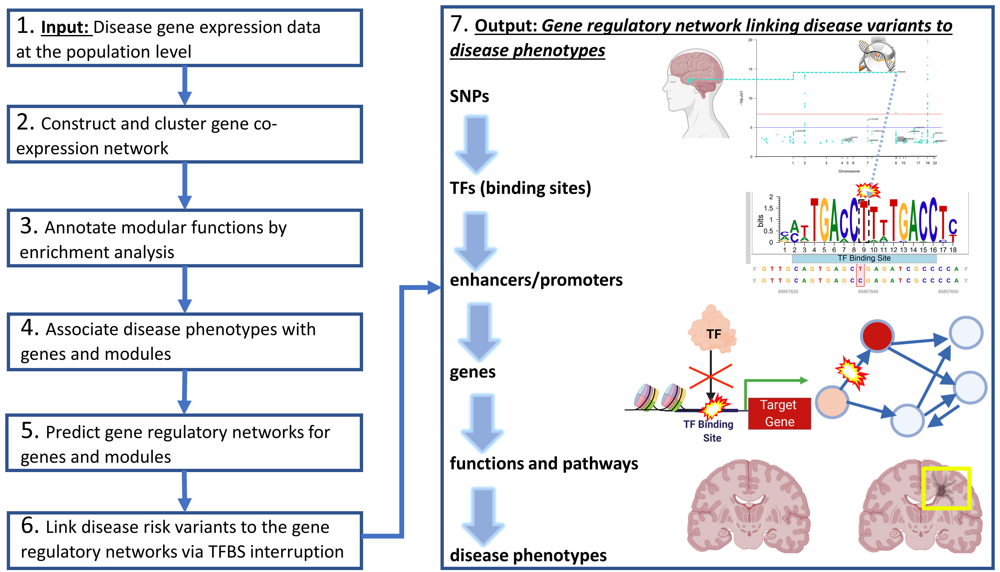

README
================

`{r setup, include=FALSE} knitr::opts_chunk$set(echo = TRUE)`

ADSNPheno: A computational pipeline of multi-omics analysis to predict gene regulatory networks from disease variants to phenotypes with applications in Alzheimer’s disease and SARS-CoV-2
===========================================================================================================================================================================================

Summary
-------

Genome-wide association studies (GWAS) have found many genetic risk
variants associated with Alzheimer’s disease (AD). However, how these
risk variants affect deeper phenotypes such as disease progression and
immune response remains elusive. Also, our understanding of cellular and
molecular mechanisms from disease risk variants to various disease
phenotypes is still limited. To address these problems, we developed a
computational pipeline of integrated multi-omics analysis from genotype,
transcriptomics, epigenomics to phenotypes for revealing gene regulatory
mechanisms from disease variants to phenotypes.

Method
------

This pipeline, ADSNPheno, aims to predict gene regulatory networks of AD
risk Single-Nucleotide Polymorphisms (SNPs) to different AD phenotypes.
In particular, ADSNPheno first clusters gene co-expression networks and
identifies the gene modules for various AD phenotypes. ADSNPheno further
predicts the transcription factors (TFs) that significantly regulate the
genes in each module, as well as the AD SNPs interrupting the TF binding
sites on the regulatory elements. Finally, ADSNPheno constructs a full
gene regulatory network linking SNPs, interrupted TFs, and regulatory
elements to target genes for each phenotype. This network thus provides
mechanistic insights of gene regulation from disease risk variants to AD
phenotypes.

Please note our pipeline, ADSNPheno:

<p align="center">
  
</p>


## Hardware Requirements

Please note that this analysis is based on R 4.0. You will only need a standard computer with enough RAM to support the operations. For predicting gene regulatory networks, a *Linux* system with 32 GB RAM and 32GB storage would be enough to support.

## Software Requirements


This is an R Markdown format used for publishing markdown documents to
GitHub. When you click the **Knit** button all R code chunks are run and
a markdown file (.md) suitable for publishing to GitHub is generated.


Including Code
--------------

You can include R code in the document as follows:

`{r cars} summary(cars)`

Including Plots
---------------

You can also embed plots, for example:

`{r pressure, echo=FALSE} plot(pressure)`

Note that the `echo = FALSE` parameter was added to the code chunk to
prevent printing of the R code that generated the plot.


## Support

Please note that this code was developed by Saniya Khullar and Daifeng Wang, Ph.D.
If you experience any issues with the code or steps in the pipeline, please reach out to Saniya Khullar at skhullar2@wisc.edu and she will be very happy to help you!

YouTube tutorials will also be available on ADSNPheno on [Saniya's YouTube channel](https://www.youtube.com/channel/UCNhVAcIdarXzTCWZ27N1EmQ) to guide you every step of the way. We also have presented our computational pipeline at an [ISCB-SC webinar](https://www.youtube.com/watch?v=ITwEzqhQnZU). 

Please visit our [lab website](https://daifengwanglab.org/) at University of Wisconsin - Madison, to learn more about our team and our work! 
   
## Demo

This demo applies our general, open-source computational pipeline, **ADSNPheno**, in the context of Alzheimer's disease (AD).  Here, we aim to reveal underlying gene regulatory mechanisms of AD risk variants to different AD phenotypes. Particularly, ADSNPheno first identifies the gene co-expression modules for various AD phenotypes via clustering gene co-expression networks. ADSNPheno further predicts the transcription factors (TFs) that significantly regulate the genes in each module, as well as the AD SNPs interrupting the TF binding sites on the regulatory elements. Finally, ADSNPheno constructs a full gene regulatory network linking SNPs, TFs, and regulatory elements to target genes for each phenotype. This network thus provides mechanistic insights of gene regulation from disease risk variants to the phenotype in AD.

Below, please note that we provide an example application of ADNSPheno to the Hippocampus Ca1 gene expression data set [GSE1297](https://www.ncbi.nlm.nih.gov/geo/query/acc.cgi?acc=GSE1297). 

**Step 1: Disease gene expression data at the population level**

Since this is microarray data, a lot of pre-processing was needed. The dataset had total RNA expression values for 22,283 HG-U133 Affymetrix Human Genome U133 Plus 2.0 Microarray Identifier probes for 31 individual postmortem samples.  These individual samples include 9 control samples (no AD), 7 samples at the initial stage, 8 samples at the moderate stage, and 7 samples at the severe stage. 

Please note that we utilized Bioconductor packages, such as: GEOquery, hgu133a.db, hgu133acdf, and Affy R packages to download the raw data. Then, we performed Robust Multichip Average (RMA) normalization [31] to account for background and technical variations among these samples.  In fact, we followed [RMA normalization for microarray data](https://felixfan.github.io/RMA-Normalization-Microarray/) for the Demo (that was specifically tailored for our same GSE1297 dataset). 


Next, we mapped those probes of microarray data to genes, averaging values that mapped to the same gene Entrez ID.  We removed probes that did not map to any known genes.  Please note that some helpful tools for obtaining the status of certain genes (such as updated gene names or status on whether they are withdrawn or discontinued) is: https://www.genenames.org/tools/multi-symbol-checker/.


In addition, we consulted the aliases2entrez package to retrieve EntrezID information on the genes.  To assist you with your gene set, please note that we have tried to build an extensive resource on some of the Entrez IDs for various genes, which we have stored in this csv: [infoDFMappingsGeneSymbolAndID.csv]("https://github.com/daifengwanglab/ADSNPheno/tree/master/data/entrezMappingInfo") (Please see: data > entrezMappingInfo > infoDFMappingsGeneSymbolAndID.csv). 


Ultimately, after pre-processing, our final dataset for the Hippocampus had 13,073 unique genes for these 31 samples.

`{r} print("hi")`

```{r}
print("hi")

```
